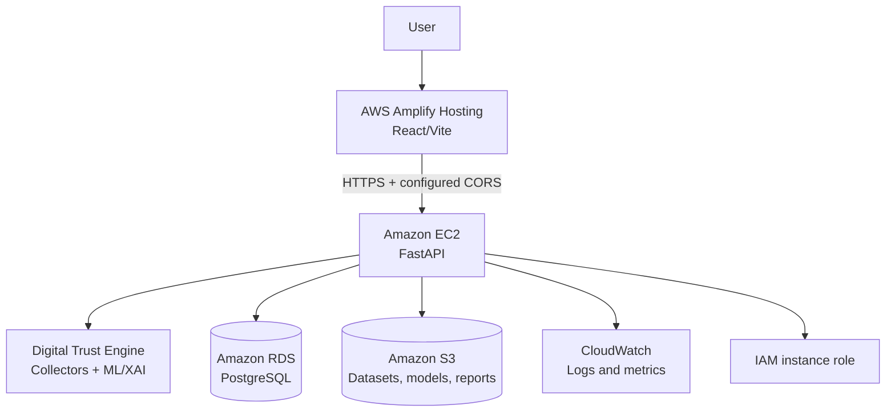

# Cloud Architecture

This document describes the intended production topology. AWS resources are not created or configured by this phase.



## Components

| Component | Role | Data and communication | Security boundary |
| --- | --- | --- | --- |
| AWS Amplify | Hosts the React frontend | Sends HTTPS API requests to EC2 | No secrets in browser code; restrict API CORS to the Amplify origin |
| EC2 | Runs the FastAPI backend and bounded collectors | Reads/writes RDS; reads model/data objects from S3; emits CloudWatch logs | Public HTTPS only through a reverse proxy/security group; no direct RDS exposure |
| FastAPI | HTTP contract and validation layer | Calls the trust engine and repository | Environment-based configuration, request limits, SSRF protections, debug disabled |
| Digital Trust Engine | Computes live score and invokes compatible model/XAI services | Receives validated public URLs; returns observed evidence | Does not map incompatible benchmark features into live predictions |
| RDS PostgreSQL | Durable analysis history and structured metadata | Private connection from EC2 only | Private subnet, security group restricted to EC2, credentials managed outside source |
| S3 | Future object storage | Datasets, model artifacts, SHAP plots, generated reports | EC2 IAM role with least-privilege bucket policy; no public bucket access |
| CloudWatch | Operational observability | Application logs, latency, errors, health metrics | IAM role-based delivery; never log credentials or sensitive payloads |
| IAM | Workload access control | EC2 role grants S3/CloudWatch permissions | No long-lived access keys in code or images |

## Local Development

```text
React/Vite on 5173 -> FastAPI on 8000 -> SQLite through SQLAlchemy
                                             -> local model/data/experiment files
```

`DATABASE_URL=sqlite:///results/trustguard.db` is the default. Docker Compose changes only the database URL and runs PostgreSQL locally. Model artifacts and benchmark datasets remain local read-only mounts; S3 is not emulated.

## Persistence and Object Storage

The backend uses a repository abstraction over SQLAlchemy. `DATABASE_URL` selects SQLite or PostgreSQL. Database initialization creates the `analyses` table and indexes without deleting existing rows. The stored JSON preserves the complete analysis evidence needed by history, feature, and explanation endpoints.

Future S3 object classes are licensed datasets, UCI/PhiUSIIL model artifacts and metadata, SHAP plots, and generated reports. Local storage remains filesystem-based until an authenticated S3 adapter and IAM policy are designed. No fake S3 fallback is present.

## Deployment Notes

The intended network layout is EC2 in a public subnet behind HTTPS and RDS in a private subnet. Internet traffic must not reach RDS directly. This phase stops at local persistence and Docker configuration; EC2, RDS, S3, IAM, Amplify, and CloudWatch are future controlled work.